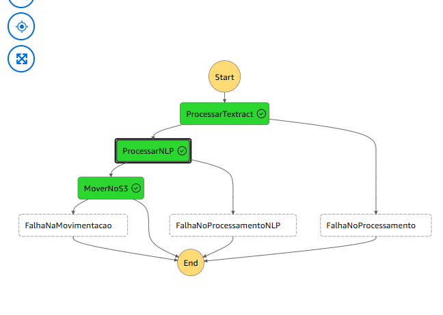

# Desafio DIO: Workflows Automatizados com AWS Step Functions

Este repositório documenta a prática e os insights adquiridos no laboratório "Consolidando Workflows Automatizados com AWS Step Functions", como parte do bootcamp da DIO. O objetivo é explorar o AWS Step Functions como um serviço de orquestração de fluxos de trabalho, integrando diversos serviços da AWS.

## O que é o AWS Step Functions?

O AWS Step Functions é um serviço de orquestração visual *low-code* que permite aos desenvolvedores criar e coordenar fluxos de trabalho complexos a partir de microserviços e serviços da AWS, como Lambda, S3, SNS, SQS e DynamoDB. Ele é baseado no conceito de Máquinas de Estado (State Machines), onde cada etapa do processo é um "estado" que pode executar uma tarefa, tomar uma decisão, esperar, ou passar para o próximo estado.

## Documentação da Prática

O laboratório foi estruturado para demonstrar a progressão do básico ao avançado, mostrando como o Step Functions gerencia o fluxo de lógica e dados.

### 1. Conhecendo o Serviço e o Projeto Modelo

A primeira etapa foi familiarizar-se com o console do Step Functions, especialmente o **Workflow Studio**, a interface visual *drag-and-drop*.

* **Conceito-Chave:** A criação de uma Máquina de Estado simples (provavelmente um "Hello, World!" com um estado `Pass`) para entender a definição da Amazon States Language (ASL) em JSON, que é gerada automaticamente pelo editor visual.
* **Benefícios:** A principal vantagem observada foi a **abstração da lógica de fluxo**. Em vez de escrever código complexo para *if/else*, *try/catch* e *loops*, o Step Functions gerencia isso visualmente.

### 2. Realizando Validações (Estado `Choice`)

Nesta etapa, exploramos como as Máquinas de Estado podem tomar decisões.

* **Conceito-Chave:** O estado `Choice` foi utilizado para criar ramificações (branching) no fluxo de trabalho.
* **Exemplo Prático:** Foi simulado um fluxo onde um dado de entrada (input JSON) era validado.
    * **SE** o campo `status` for `"APROVADO"`, o fluxo segue para um caminho (ex: "Processar Pagamento").
    * **SENÃO**, o fluxo segue para outro (ex: "Enviar Notificação de Falha").
* Isso demonstra como o Step Functions pode atuar como um roteador de lógica de negócios.

### 3. Criando e Executando Lambda (Estado `Task`)

Este é o caso de uso mais comum: orquestrar funções AWS Lambda.

* **Conceito-Chave:** O estado `Task` foi usado para invocar uma função Lambda.
* **Fluxo de Dados:** O Step Functions passa seu JSON de entrada para a função Lambda. A saída (retorno) da Lambda se torna a entrada para o próximo estado no fluxo de trabalho.
* **Exemplo Prático:** Criamos uma Máquina de Estado que:
    1.  Recebe um input.
    2.  Usa um estado `Task` para enviar esse input para uma função Lambda (ex: uma função que "processa dados").
    3.  A Lambda executa sua lógica de negócios e retorna um resultado.
    4.  O Step Functions recebe esse resultado e segue para o próximo estado (ex: um estado `Success`).
 
### Exemplo Prático: Workflow de Processamento de Documentos

Como parte da minha experiência prática com a AWS, desenvolvi um workflow com o Step Functions para automatizar o processamento de documentos. A imagem a seguir é o gráfico de execução dessa máquina de estado:

Este fluxo demonstra um caso de uso real e robusto:

1.  **Start:** O workflow é iniciado (provavelmente por um evento, como um arquivo chegando no S3).
2.  **ProcessarTextract:** A primeira tarefa (`Task`) é invocada, provavelmente uma função Lambda que usa o serviço **AWS Textract** para extrair texto e dados do documento.
3.  **ProcessarNLP:** Se o Textract for bem-sucedido, o texto extraído é passado para a próxima tarefa, que realiza o Processamento de Linguagem Natural (NLP), talvez usando o **AWS Comprehend**.
4.  **MoverNoS3:** Após o processamento do NLP, uma tarefa final move os resultados (ex: um JSON enriquecido) para um bucket S3 de destino.
5.  **End:** O fluxo é concluído com sucesso.

O mais importante é o **Tratamento de Erros** nativo do Step Functions:
* Se a etapa `ProcessarTextract` falhar, o fluxo é desviado para `FalhaNoProcessamento`.
* Se a etapa `ProcessarNLP` falhar, o fluxo é desviado para `FalhaNoProcessamentoNLP`.
* Se a etapa `MoverNoS3` falhar, o fluxo é desviado para `FalhaNaMovimentacao`.

Todos os caminhos, de sucesso ou falha, convergem para o `End`, garantindo que o workflow sempre termine de forma controlada e monitorada. Este exemplo prático encapsula perfeitamente os conceitos de orquestração, resiliência e separação de responsabilidades.

## Principais Insights e Anotações da Experiência

Este laboratório solidificou a compreensão do papel do Step Functions na arquitetura serverless.

1.  **Orquestração vs. Coreografia:** Ficou claro que o Step Functions é um serviço de **Orquestração** (um "maestro" central que diz a cada serviço o que fazer e quando). Isso contrasta com serviços como o EventBridge, que facilitam a **Coreografia** (serviços reagem a eventos de forma descentralizada).

2.  **Separação de Responsabilidades:** A maior vantagem é a separação da **lógica de fluxo** (o "o quê" e "quando") da **lógica de negócios** (o "como"). O Step Functions cuida do fluxo, e as funções Lambda cuidam das tarefas de negócios. Isso torna o código das Lambdas mais simples, focadas e fáceis de manter.

3.  **Monitoramento e Depuração Visual:** O monitoramento é o ponto alto. O console do Step Functions mostra visualmente cada execução, destacando em verde (sucesso) ou vermelho (falha) exatamente **qual estado** falhou e o porquê (logs de erro). Isso reduz drasticamente o tempo de depuração em sistemas distribuídos.

4.  **Resiliência e Tratamento de Erros:** O Step Functions possui mecanismos nativos de `Retry` (tentar novamente em caso de falha) e `Catch` (capturar um erro e desviar o fluxo), que podem ser configurados diretamente na definição da máquina de estado, sem precisar escrever esse código na aplicação.

5.  **Integração Direta (Sem Lambda):** Foi explorado como o Step Functions pode se integrar diretamente com outros serviços da AWS (ex: S3, DynamoDB, SNS) sem nem mesmo precisar de uma função Lambda, otimizando custos e simplificando ainda mais o workflow.
